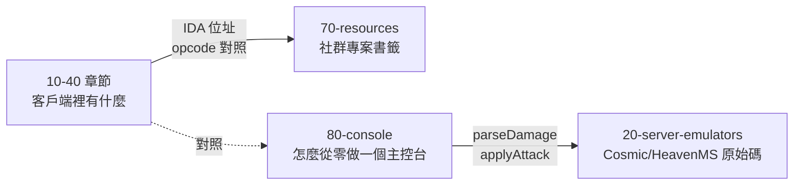

# 80 · 伺服器主控台開發

> 從零開始寫一個楓之谷伺服器主控台 — 42 部影片、27.2 小時的完整教學筆記,
> 依**技術主題**重組為 18 頁、319 條可獨立引用的條目。

## 這一章是什麼

原始素材是 42 支影片的**逐片筆記**,適合「重看第 N 課」,但同一個主題
(ToggleGroup、資源釋放、setPadding)散落在四五課裡。

本章依主題重組,回答的是「**要達成 X,該用什麼、怎麼寫、會踩什麼坑**」。
每條都有穩定 ID、來源課次與時間戳,可獨立引用。

| 項目 | 數值 |
|---|---|
| 影片 | 42 部(27 課循序 + 8 支源碼專題 + 7 支短片) |
| 總時長 | 27.2 小時 |
| 主題頁 | 18 頁 |
| 條目 | **319** 條 |
| 原始逐片筆記 | 42 份(2.6 MB) |
| 逐字稿附錄 | 42 份(1.1 MB) |

!!! warning "引用前先看「坑」欄"
    每條都有「坑」段落,記錄教學本身的錯誤、口述與畫面的矛盾、以及語音辨識誤字。
    **其中 W15(伺服器遊戲機制)有講者口述與原始碼直接矛盾的總表** ——
    那是本批資料價值最高的部分,不要略過。

## 18 個主題

| 主題 | 條目 | 內容 |
|---|---|---|
| [W01 環境、選型與專案基礎](W01_環境、選型與專案基礎.md) | 10 | AWT/Swing/JavaFX/SWT 選型比較、`2.x-course` 分支 |
| [W02 JavaFX 版面配置與元件樹](W02_JavaFX版面配置與元件樹.md) | 12 | BorderPane/VBox/HBox/AnchorPane/StackPane |
| [W03 視窗與自訂標題列](W03_視窗與自訂標題列.md) | 18 | 自訂窗頭、icon 路徑除錯、最大化按鈕 |
| [W04 選單系統與視圖切換](W04_選單系統與視圖切換.md) | 22 | ToggleButton + ToggleGroup、Enum 綁定、反射切換 |
| [W05 服務起停與日誌輸出](W05_服務起停與日誌輸出.md) | 18 | 服務開關、Timer 記憶體洩漏、log4j 接入 |
| [W06 載入彈窗與服務器設置](W06_載入彈窗與服務器設置.md) | 18 | 載入動畫、連接設定、失敗處理 |
| [W07 自訂元件庫](W07_自訂元件庫.md) | 16 | 樣式工具類、增量式 setStyle、共用元件封裝 |
| [W08 配置管理與熱重載](W08_配置管理與熱重載.md) | 22 | YAML 設定、WatchService 熱重載、型別轉換 |
| [W09 常用功能頁](W09_常用功能頁.md) | 18 | 在線玩家、遊戲配置、公告、發包工具 |
| [W10 玩家管理與遊戲內發放](W10_玩家管理與遊戲內發放.md) | 18 | 玩家清單、道具發放、權限分級 |
| [W11 指令管理](W11_指令管理.md) | 20 | GM 指令註冊、參數解析、執行權限 |
| [W12 KOOK 整合](W12_KOOK整合.md) | 20 | 機器人串接、指令轉發、權限綁定 |
| [W13 打包與部署](W13_打包與部署.md) | 22 | jar 轉 exe、Windows/Linux 部署、更新機制 |
| [W14 控制台框架源碼架構](W14_控制台框架源碼架構.md) | 16 | 整體架構、介面抽象、依賴注入 |
| [W15 伺服器遊戲機制](W15_伺服器遊戲機制.md) | 24 | **傷害計算、卷軸機率、商城購買、反作弊** |
| [W16 協作流程與改版實作](W16_協作流程與改版實作.md) | 14 | Gitee 分支協作、版本管理、改版記錄 |
| [W17 客戶端封包分析](W17_客戶端封包分析.md) | 23 | **Detours Hook、ProcessPacket、逆向分析** |
| [W18 產品演進與完結展示](W18_產品演進與完結展示.md) | 8 | 成品回顧、後續規劃 |

## 與其他章節的關係

本章與 WIKI 其他部分**幾乎不重疊**,回答的是不同問題:



| 你想做 | 看哪裡 |
|---|---|
| 理解客戶端二進位 | [10-client-analysis](../10-client-analysis/index.md) |
| 查 opcode 數值 | [40-protocol](../40-protocol/index.md) 或 `facts.json` |
| **寫一個伺服器主控台** | **本章 W01–W14** |
| **搞懂伺服器端怎麼算傷害** | **本章 W15** |
| **Hook 客戶端攔封包** | **本章 W17** |
| 找現成專案 | [GitHub 專案書籤](../70-resources/github-bookmarks/index.md) |

!!! tip "W15 與本 WIKI 的 40-protocol 互相印證"
    W15-001 描述四種 Handler 共用 `parseDamage` → `applyAttack` 的管線,
    這與本 WIKI 從 `v83.idb` 反組譯出的
    [`AbstractDealDamageHandler`](../40-protocol/packet-analysis.md) 結構一致。
    **W15 講的是伺服器端實作,本 WIKI 40-protocol 記的是客戶端對應的位址** ——
    兩邊一起看能建立完整的往返對照。

## 機器可讀索引

`wiki/console-index.jsonl` 是本章的機器可讀索引,每行一筆:

```jsonc
{
  "id": "W15-007",              // 穩定 ID
  "topic": "W15",
  "title": "客戶端報的傷害與服務端上限對帳,超 1.5 倍開始 auto ban",
  "keywords": ["CheatingOffense", "autoBan", "parseDamage"],
  "source": "傷害計算介紹 22:00–25:00｜`S2_伤害计算介绍_教學筆記.md`",
  "hasCode": true,
  "pitfall": "……"
}
```

```bash
# 找所有提到某個類別的條目
grep -i "ToggleGroup" wiki/console-index.jsonl

# 某個坑出現在哪些地方
grep '"pitfall":.*掉檔' wiki/console-index.jsonl

# 某課貢獻了哪些條目
grep '"sourceTag": "S2"' wiki/console-index.jsonl
```

## 原始素材

本章 18 個主題頁由 42 份逐片筆記重組而成。**逐片筆記與逐字稿不在本 repo**,
保留在原作者的工作目錄。原始檔案命名:

| 檔名模式 | 內容 |
|---|---|
| `L01`–`L27_教學筆記.md` | 27 課循序課程的逐片筆記 |
| `S1`–`S8_教學筆記.md` | 8 支源碼專題片 |
| `U36`–`U42_教學筆記.md` | 7 支短片 |
| `*_逐字稿.md` | 42 份語音逐字稿(保留原始口語,未做摘要) |
| `wiki/` | 本章來源:18 個主題頁 + `index.jsonl` |

每條的「來源」欄都標明課次、時間戳與原始檔名,可回溯到逐片筆記的對應段落。
